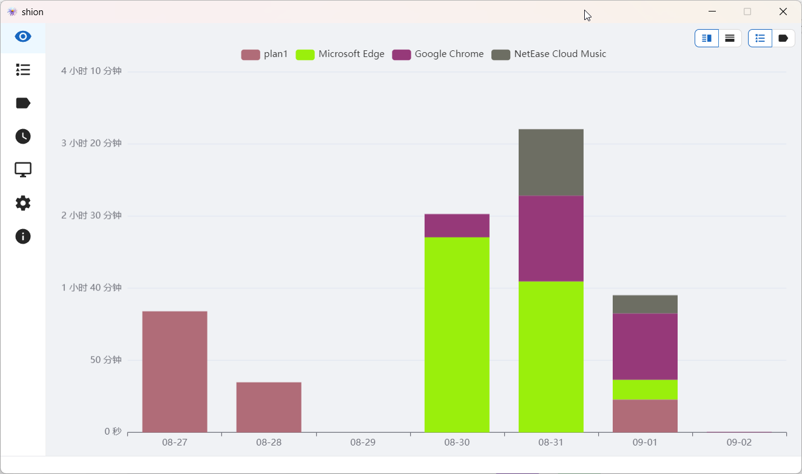

  

  <a href="./README.md">English</a>
  中文

> **Warning**
> 处于开发阶段，谨慎使用🚧

## 介绍

> 曾经读过的一本书，弹过的一首曲子。也许在某个午后，翻开了它你依然能回忆起那股气息

## 功能

- [x] 手动记录时间，标签细致分类
- [x] 图表、日历展示数据
- [x] 自动记录时间，监听程序运行🚧

## 截图

## 快速入门

[文档](https://shion.app/zh/)

