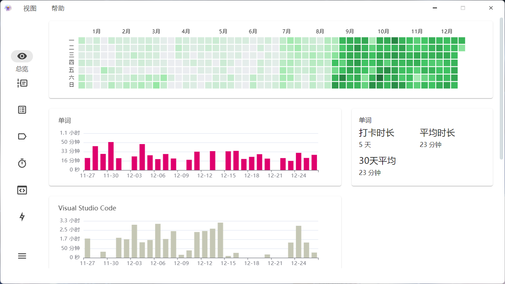
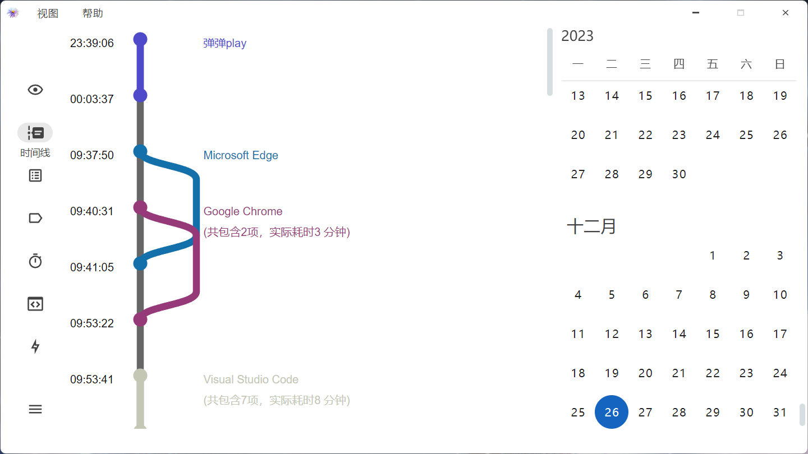
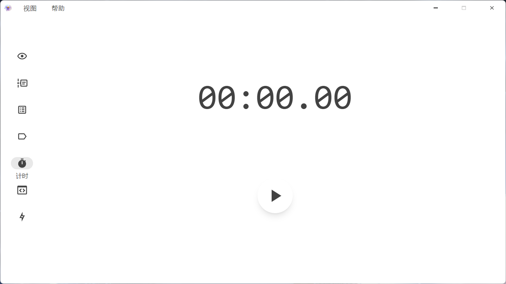
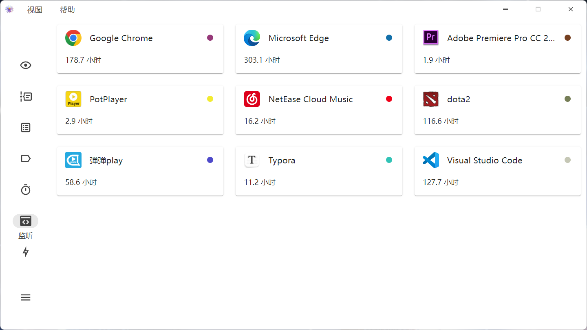

  

 

  
  

  <a href="./README.md">English</a>
  中文

# Shion🍂

> **Warning**
> 处于开发阶段，谨慎使用🚧

## 介绍

> 曾经读过的一本书，弹过的一首曲子。也许在某个午后，翻开它你依然能回忆起那股气息

一款时间追踪软件，帮助您记录下一段时间

+ 📊数据展示卡片
+ 📅每日时间线记录
+ 🏷️记录分类
+ 👀监听程序活动
+ 📖日记

> 正在施工中🚧

- [ ] 📱安卓端适配
- [ ] 💡更多功能

## 截图

+ 添加多种卡片展示收录数据

+ 时间线展示一日行程

+ 手动记录一段时间

+ 自动监听程序列表

