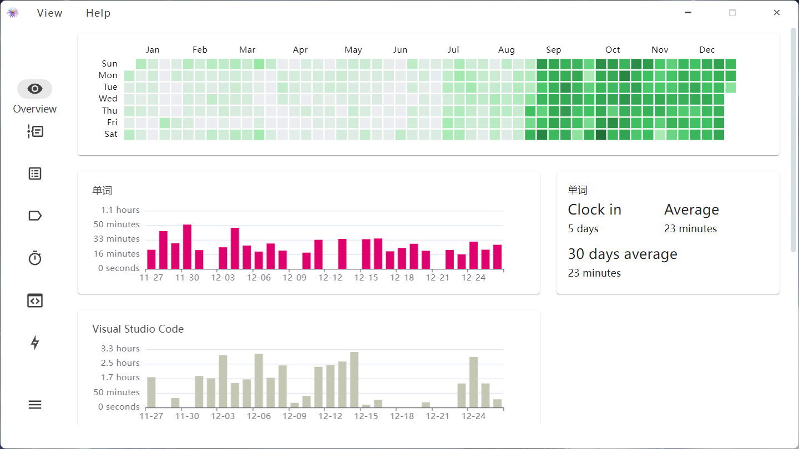
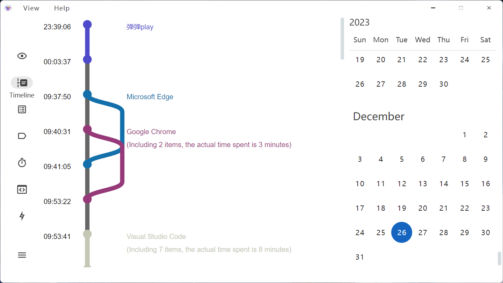
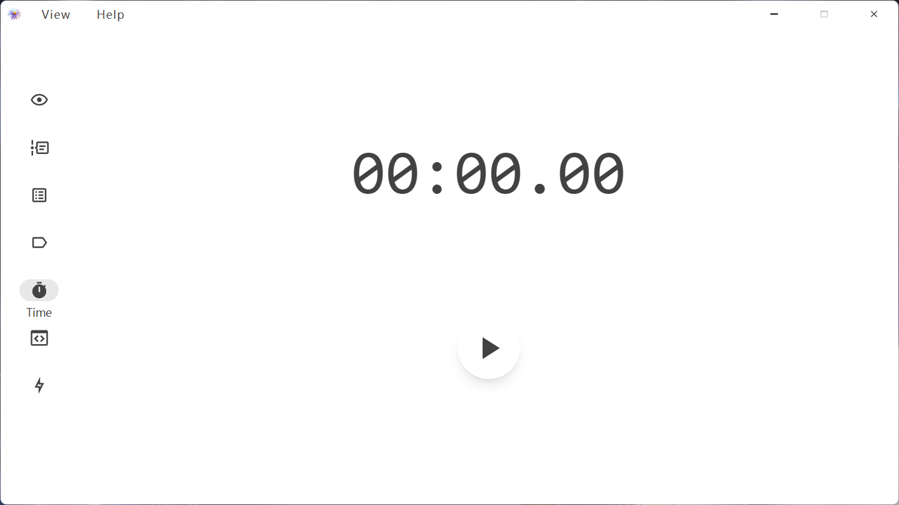
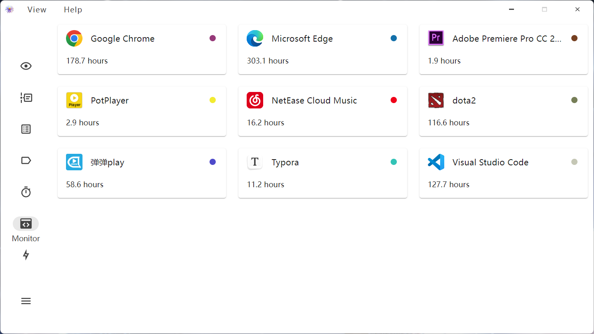

   

 

   
   

   English
   <a href="./README-ZH.md">中文</a

# Shion🍂

> **Warning**
> In development stage, use with caution🚧
>
> Document from machine translation🤖

## Introduce

>A book I once read, a piece of music I played. Maybe one afternoon, you can still recall that breath when you open it.

A time tracking software to help you record a period of time

+ 📊Data display card
+ 📅Daily timeline
+ 🏷️Label
+ 👀Watch program activity
+ 📖Diary

> Under construction🚧

- [ ] 🛠️Android version adaptation
- [ ] 💡More features

## Screenshot

+ Add a variety of cards to display collected data

+ Timeline showing one-day itinerary

+ Manually record for a period of time

+ Program monitor list

