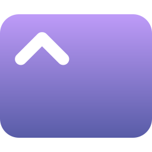

   

 

  
  

   English
   <a href="./README-ZH.md">中文</a>

# Shion🍂

> **info**
> In beta🥳
>
> Document from machine translation🤖

<a href="https://shion.app/download" target="_blank">Download</a>

## Introduction

Shion is a time tracking software used to record specific situations that occur during a certain time period. You can manually record what is happening, or have the ship automatically monitor the activity of specific software. Of course, it's not just a simple record of the start and end times, but you can also add text, pictures, and videos like writing a diary

Each data item provides grouping, and you can package the related data together to present them in a clear and organized manner in charts and timelines. Customize your overview interface with multiple charts, so you can have a clearer understanding of the passage of time ⌛

+ 📊Overview Data Card
+ 📅Timeline
+ 🏷️Record classification
+ 👀Monitor program activities
+ 📖Record the moment

> Under construction🚧

- [ ] 📱Android version adaptation
- [ ] 💡More features

